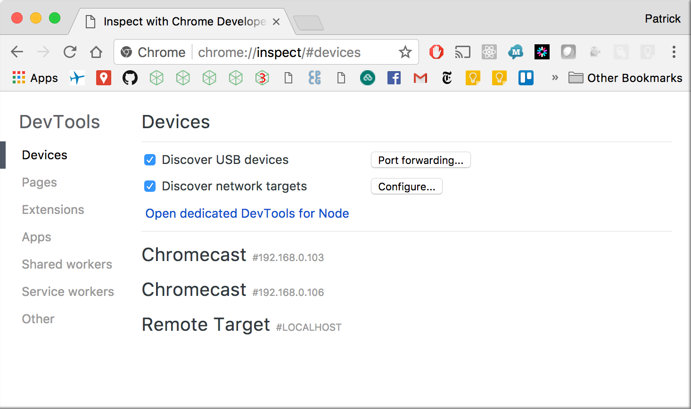
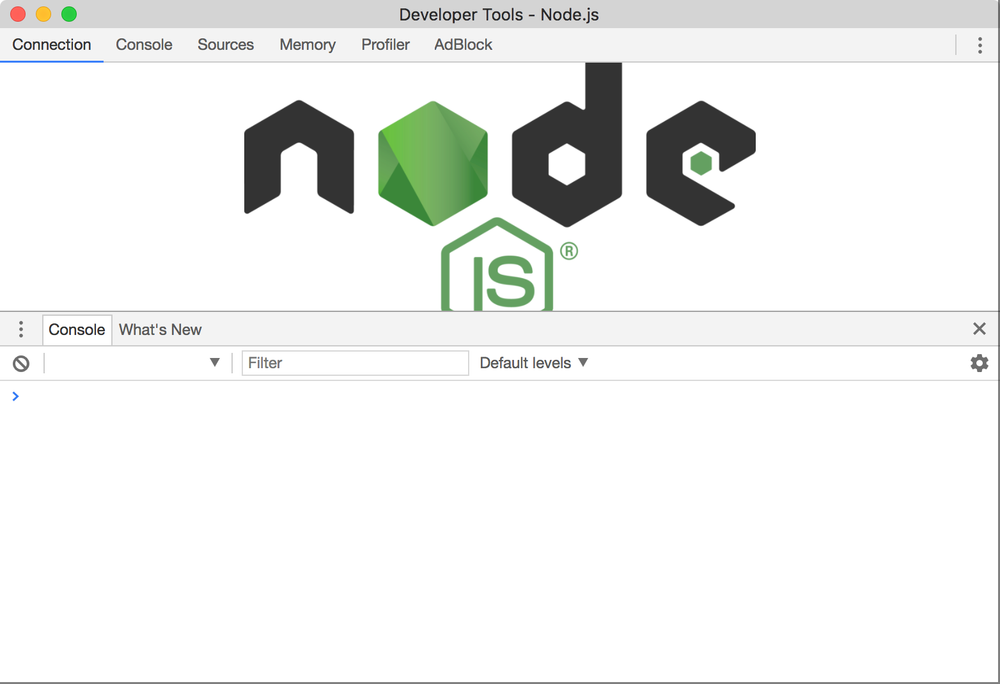
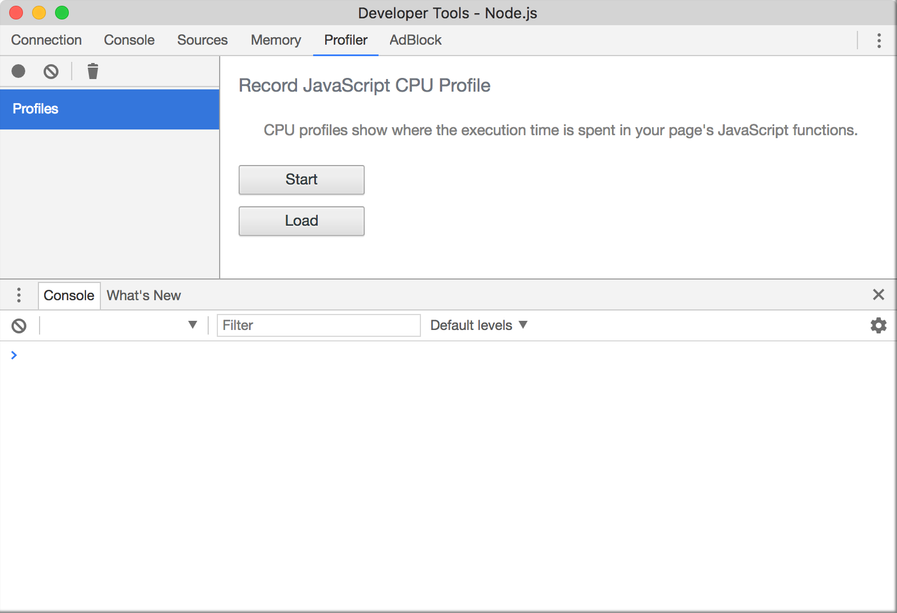
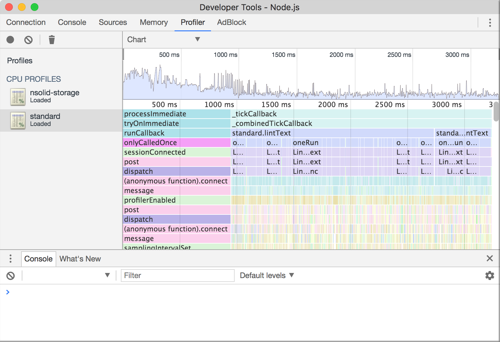

loading a CPU profile from Node.js in Chrome Dev Tools
================================================================================

Assuming you have `.cpuprofile` file that you'd like to view, follow the
instructions below to load it in Chrome Dev Tools.

Open the Chrome browser, enter `chrome://inspect/` in the URL bar, and press
enter.  You should see a page like below.

Click the link "Open dedicated DevTools for Node" in the "Devices" column near
the middle of the page.  You should see a new window open like below.

Switch to the Profile tab, and you should see the following:

Click the "Load" button, select a `.cpuprofile` file, and then select it in the
list of loaded profiles under "CPU PROFILES" on the left.

There are three views of the CPU profile data, with a view switcher pull down
near the top of the window:

* Chart
* Heavy (Bottom Up)
* Tree (Top Down)

After selecting the "Chart" view, you should see something similar to the
following:

For more information on using the Profiler tool, read
[Speed Up JavaScript Execution][] at the Google Developer's site.

[Speed Up JavaScript Execution]: https://developers.google.com/web/tools/chrome-devtools/rendering-tools/js-execution
